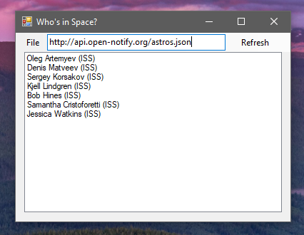
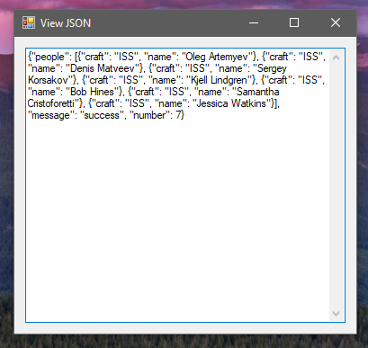

# Whose in Space?

Exercise #47 from [*Exercises for Programmers*](https://pragprog.com/titles/bhwb/exercises-for-programmers/), by Brian P. Hogan (ISBN: 9781680501223):

> Did you know you can find out exactly who's in space right now?
> The Open Notify API provides that information. Visit
> <http://api.open-notify.org/astros.json> to see not only how many
> people are currently in space but also their names and which
> spacecraft they're on.
>
> Create a program that pulls in this data and displays the
information from this API in a tabular format.

## Preview

The main window displays the URL from which the data is loaded, as well as the list of astronauts and the craft they are on.

From **File &rarr; View JSON**, you can see the JSON that was last loaded.

